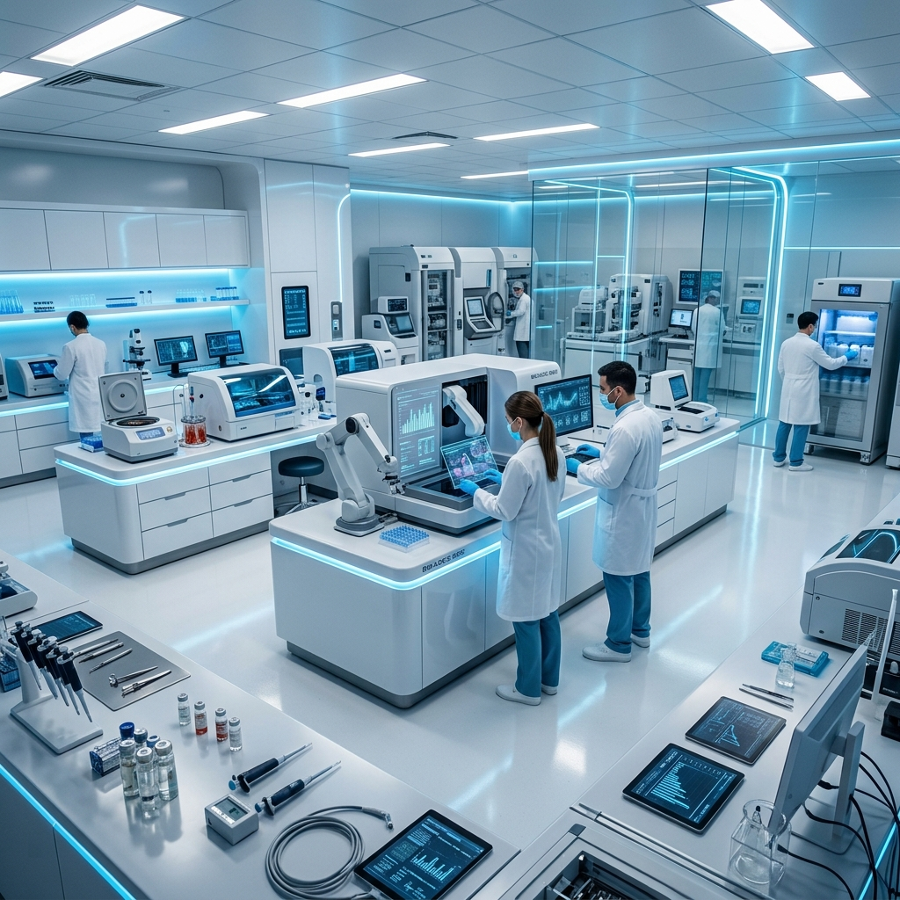
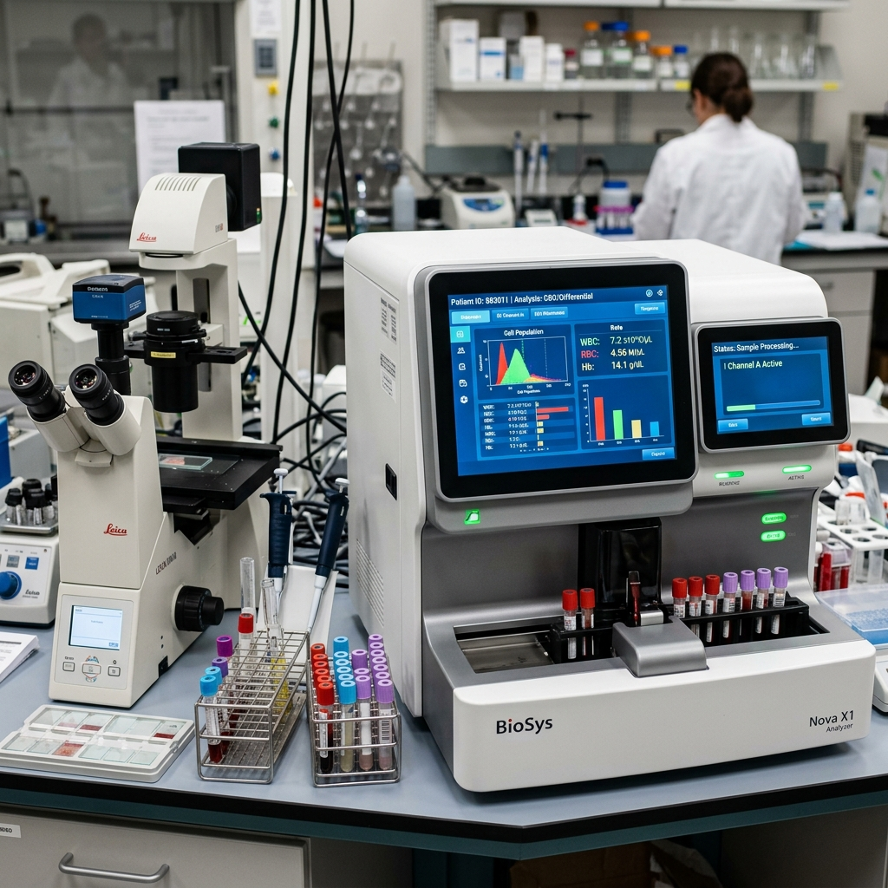
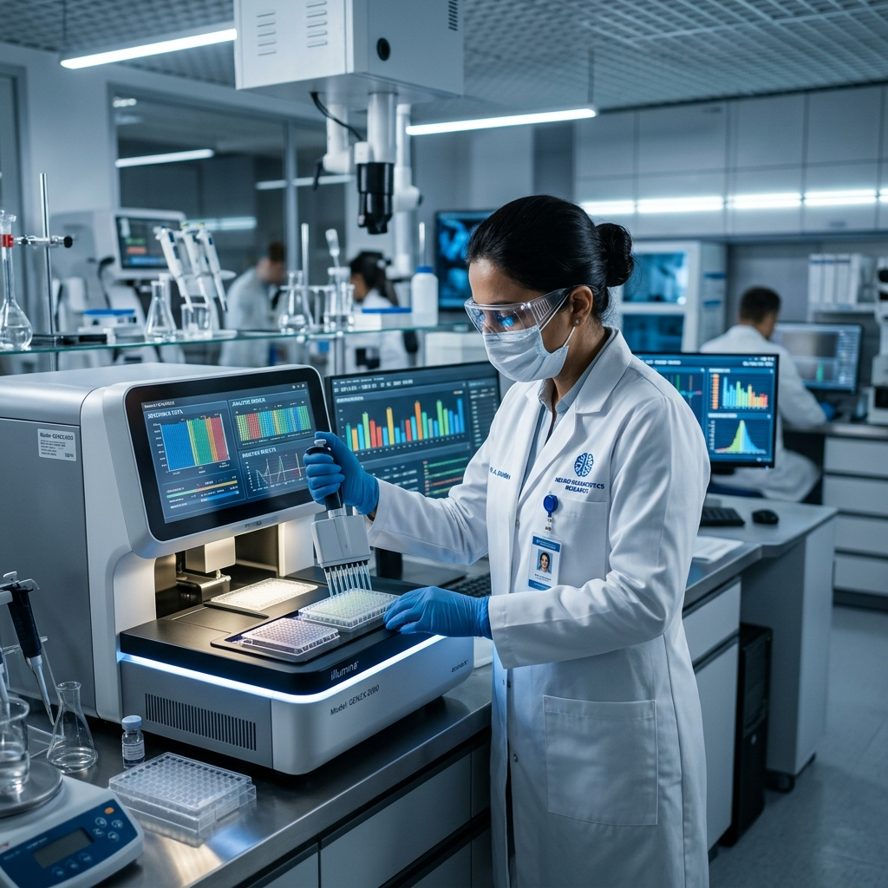

# 🔬 Dr. Baviskar Pathology Lab

Welcome to **Dr. Baviskar Pathology Lab** – a state-of-the-art medical diagnostic platform designed for efficiency, accuracy, and patient comfort.



## 🌟 Key Features

- **Advanced Diagnostics**: Real-time test tracking and accurate reporting.
* **Cinematic Experience**: High-performance UI with smooth scroll-triggered animations.
* **Glassmorphic Design**: Modern, premium aesthetic for a professional medical feel.
* **Mobile Optimized**: Fully responsive interface for on-the-go health management.

<div align="center">
  
  
</div>

## 🚀 Run Locally

**Prerequisites:**  Node.js (v18+)

1. **Clone & Install**:
   ```bash
   npm install
   ```
2. **Environment Setup**:
   Set the `GEMINI_API_KEY` in `.env.local` to your Gemini API key.
3. **Launch**:
   ```bash
   npm run dev
   ```

## 🛠️ Tech Stack

- **Frontend**: React, Tailwind CSS, Framer Motion
- **Icons**: Lucide React
- **Animations**: GSAP, Motion/React
- **Type**: TypeScript

---

© 2025 Dr. Baviskar Pathology Lab. All rights reserved.
