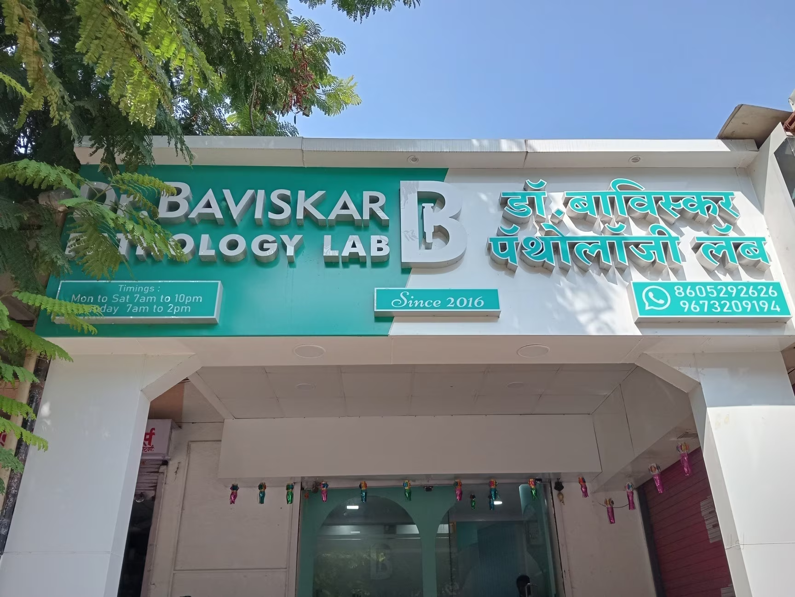

# 🔬 Dr. Baviskar Pathology Lab

[](https://nextjs.org/)
[](https://www.typescriptlang.org/)
[](https://tailwindcss.com/)
[](https://www.sanity.io/)
[](https://www.framer.com/motion/)

> **Dr. Baviskar Pathology Lab** is a premium, state-of-the-art medical diagnostic platform built for the modern era. It combines clinical precision with a cinematic digital experience, featuring advanced animations, 3D integration, and AI-driven insights.



---

## ✨ Key Features

### 🎬 Cinematic UI/UX
Experience high-performance, scroll-triggered animations powered by **GSAP** and **Framer Motion**. The interface features a modern **Glassmorphic** aesthetic with smooth transitions that mirror the precision of a high-tech laboratory.

### 📰 Dynamic Medical Journal
A fully-integrated blog system managed via **Sanity CMS**. Get real-time medical insights, wellness tips, and lab updates with a seamless content delivery pipeline.

### 🧪 Smart Diagnostic Catalog
Browse through a comprehensive catalog of 1,000+ specialized clinical examinations. Features advanced filtering, search, and a premium booking system.

### 🤖 AI-Powered Health Insights
Integrated with **Google Gemini AI** to provide smart assistance and context-aware medical information processing.

### 📱 Performance First
Fully responsive architecture optimized for all devices. Leveraging **Next.js 15** for lightning-fast server-side rendering and optimal SEO performance.

---

## 🛠️ Tech Stack

### **Core Frameworks**
- **Next.js 15**: The React framework for production.
- **React 19**: Modern component architecture.
- **TypeScript**: Static typing for robust code.

### **Styling & UI**
- **Tailwind CSS 4**: Utility-first styling with modern CSS features.
- **Radix UI**: Accessible, unstyled primitives for UI components.
- **Lucide React**: Clean, consistent iconography.

### **Content & Data**
- **Sanity CMS**: Headless CMS for flexible content management.
- **GROQ**: Powerful querying language for medical data.
- **Google Sheets API**: Real-time data logging and synchronization.

### **Animations & Graphics**
- **GSAP & ScrollTrigger**: Cinematic, timeline-based animations.
- **Framer Motion**: Gesture-driven and layout transitions.
- **Spline & Three.js**: Immersive 3D interactive elements.

---

## 🚀 Getting Started

### 1. Clone the repository
```bash
git clone https://github.com/himanshud2407/pms.git
cd pms
```

### 2. Install dependencies
```bash
npm install
```

### 3. Environment Setup
Create a `.env.local` file in the root directory and add the following:
```env

# Sanity Configuration
NEXT_PUBLIC_SANITY_PROJECT_ID="project_id"
NEXT_PUBLIC_SANITY_DATASET="production"

# Google Sheets Integration
NEXT_PUBLIC_GOOGLE_SHEET_URL="your_google_script_url"
```

### 4. Run the development server
```bash
npm run dev
```
Open [http://localhost:3000](http://localhost:3000) to see the result.

---

## 📂 Project Structure

```text
.
├── src/
│   ├── app/            # Next.js App Router
│   ├── components/     # Reusable UI components
│   ├── lib/            # Utility functions & API clients
│   └── sanity/         # Sanity CMS schemas and client
├── public/             # Static assets
├── docs/               # Project documentation & images
└── tailwind.config.ts  # Styling configuration
```

---

## 📄 License

Distributed under the MIT License. See `LICENSE` for more information.

---

## 🤝 Contact

**Dr. Baviskar Pathology Lab** - [Contact Us](https://drbaviskarpathology.com)

Project Link: [https://github.com/himanshud2407/pms](https://github.com/himanshud2407/pms)

---

<p align="center">
  Built with ❤️ for a Healthier Tomorrow
</p>
